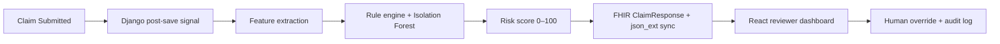

# ClaimGuard — Multi-Track Explainable AI Fraud Overlay

> **Technikali** — openIMIS Hackathon submission

[](./LICENSE.md)
[](https://openimis.org)
[](https://openimis.org)
[](https://openimis.org)

**Track Submission:** Track 3 (Claims Management & Fraud Detection)  
**Cross-Track Integrations:** Track 5 (AI & Emerging Tech) & Track 1 (Innovation Track)  
**License:** [GNU AGPL v3](./LICENSE.md)

---

## Problem Statement

Automated fraud adjudication modules often operate as unexplainable "black boxes." When a machine learning model flags a claim as anomalous, human reviewers face alert fatigue and a lack of contextual trust, leading to system overrides that leak billions of shillings annually.

## Our Solution

ClaimGuard bridges the gap between pure statistical machine learning and human-centered design. By merging Track 3's processing rails with Track 5's AI capabilities, we engineered an overlay that hooks natively into openIMIS via Django signals — **without monkey-patching core workflows**.

The system:

- Extracts **hyper-local facility baselines** from historical Tanzania demo data
- Translates **Isolation Forest** anomalies into plain-language, high-signal medical risk vectors
- Surfaces results on a polished **React reviewer panel** with override workflows and audit logging

---

## Architecture & Data Flow



| Stage | Track | What happens |
|-------|-------|--------------|
| **Ingestion** | 1 / 3 | Django `post_save` signals intercept claim submission seamlessly |
| **Context extraction** | 3 | Weekly billing deviations vs. historical Tanzania demo baselines via Django ORM aggregations |
| **XAI engine** | 5 | Features pass to an Isolation Forest model; quantitative weights map to explainable reason codes |
| **Dashboard** | 3 / 5 | Priority queue, Financial Analytics Panel, metric alert grids, and override workflow |

### Risk tiers

| Score | Tier | Default action |
|-------|------|----------------|
| 0–30 | Green | Auto-approve |
| 31–70 | Amber | Flag for review |
| 71–100 | Red | Auto-hold |

---

## Repository Map

This distribution wires ClaimGuard into a full openIMIS Docker stack. The hackathon submission spans these public forks:

| Repository | Role |
|------------|------|
| [openimis-dist_dkr](https://github.com/nosh-thee-techy/openimis-dist_dkr) | Docker compose, volume mounts, frontend image build |
| [openimis-be-claimguard_py](https://github.com/Nosh-thee-techy/openimis-be-claimguard_py) | Django module — scoring engine, GraphQL, REST API |
| [openimis-fe-claimguard_js](https://github.com/Nosh-thee-techy/openimis-fe-claimguard_js) | React module — dashboard, XAI panel, priority queue |
| [openimis-be_py](https://github.com/Nosh-thee-techy/openimis-be_py) | Backend assembly with `claimguard` in `openimis.json` |
| [openimis-fe_js](https://github.com/Nosh-thee-techy/openimis-fe_js) | Frontend assembly with `@openimis/fe-claimguard` linked locally |

---

## Prerequisites

- Docker & Docker Compose
- Sibling clones checked out next to this repo:

```
parent/
├── openimis-dist_dkr/          ← you are here
├── openimis-be_py/
├── openimis-be-claimguard_py/
├── openimis-fe_js/
└── openimis-fe-claimguard_js/
```

---

## Installation & Setup

### 1. Clone the stack

```bash
git clone https://github.com/nosh-thee-techy/openimis-dist_dkr.git
git clone https://github.com/Nosh-thee-techy/openimis-be_py.git
git clone https://github.com/Nosh-thee-techy/openimis-be-claimguard_py.git
git clone https://github.com/Nosh-thee-techy/openimis-fe_js.git
git clone https://github.com/Nosh-thee-techy/openimis-fe-claimguard_js.git
```

### 2. Configure environment

```bash
cd openimis-dist_dkr
cp .env.example .env
# Edit .env — set DOMAIN, DB credentials, SECRET_KEY, etc.
```

### 3. Load the Tanzania demo dataset

Ensure the Tanzania demo dataset is loaded (`demo.sql`) into your database before scoring claims.

### 4. Verify module registration

`claimguard` must appear in `openimis-be_py/openimis.json`:

```json
{ "name": "claimguard", "pip": "-e /openimis-be/openimis-be-claimguard_py" }
```

The frontend assembly references `@openimis/fe-claimguard` via a local file link in `openimis-fe_js/openimis.json`.

### 5. Start the stack

```bash
docker compose up -d
```

`compose.base.yml` mounts the ClaimGuard backend module and builds a custom frontend image (`openimis-fe:claimguard`).

### 6. Migrate and train (first run)

```bash
docker compose exec backend python manage.py migrate claimguard
docker compose exec backend python manage.py generate_synthetic --count 100
docker compose exec backend python manage.py train_model
```

### 7. Access the UI

Open your configured `DOMAIN` in a browser. Navigate to **Claims → ClaimGuard Dashboard** for the fraud analytics panel and priority review queue.

---

## API Surface

| Method | Path | Description |
|--------|------|-------------|
| `GET` | `/api/claimguard/scores/` | List scores (`?tier=red`) |
| `GET` | `/api/claimguard/scores/<claim_id>/` | Score for one claim |
| `POST` | `/api/claimguard/scores/<claim_id>/override/` | Auditor override with justification |
| `GET` | `/api/claimguard/analytics/` | Dashboard summary metrics |

GraphQL queries (`claimFraudScore`, `claimFraudScores`) and the `overrideClaimFraudScore` mutation are also available through the standard openIMIS GraphQL endpoint.

---

## Known Limitations & Future Roadmap

- **Supervised retraining loops** — Future sprints will pipe human override text justifications directly back into the scikit-learn training architecture.
- **Model drift monitoring** — Baseline recalculation is manual today; automated weekly refresh is planned.
- **Multi-country baselines** — Current facility baselines are tuned for the Tanzania demo dataset.

---

## Development

```bash
# Rebuild the ClaimGuard frontend module
cd ../openimis-fe-claimguard_js && npm run build

# Run backend unit tests (inside the backend container)
docker compose exec backend python manage.py test claimguard
```

---

## Submission

**Release tag:** `v1.0-hackathon`

---

## License

ClaimGuard is released under the [GNU Affero General Public License v3](./LICENSE.md), consistent with the openIMIS ecosystem.
